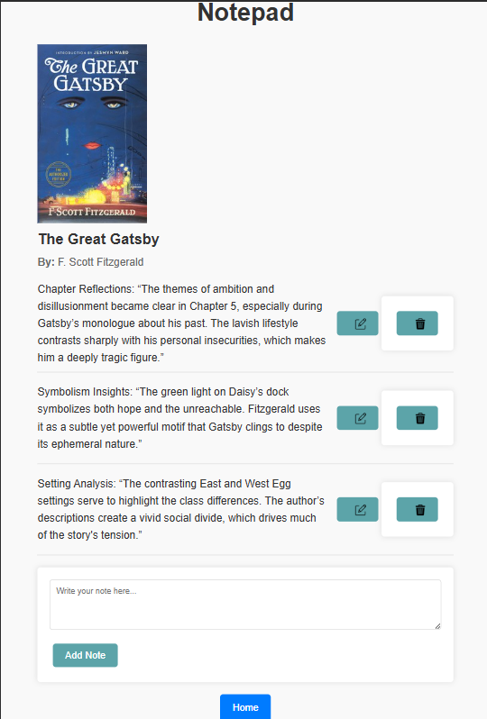
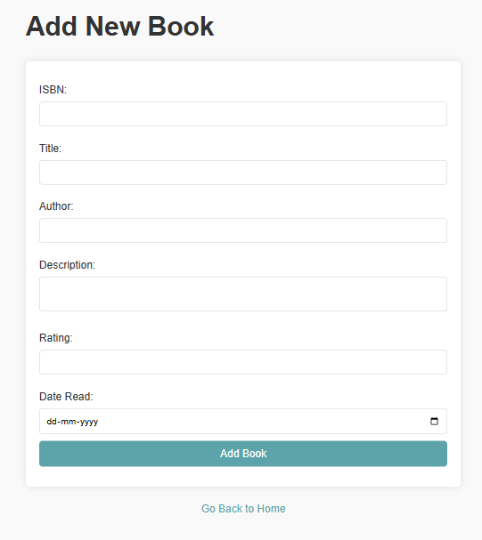
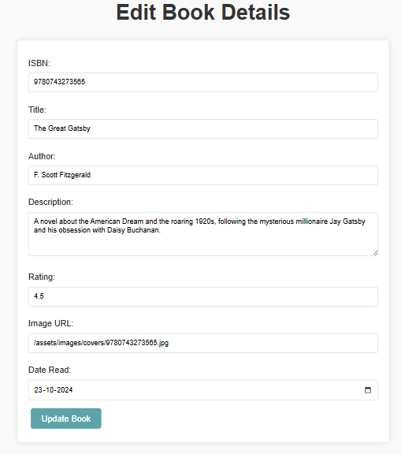

# 📚 LibroSphere - Book Review & Note-taking Web App
LibroSphere-Bookshelf is a personal web application designed to help users organize their non-fiction book reviews, track reading progress, and maintain notes for easy reference. Featuring sorting options, an integrated cover image fetcher, and an intuitive note-taking interface, BookNotes brings simplicity and structure to book tracking.

# 📋 Features
Home Page with Book List: Displays all stored books with sorting options by title, rating, or date read. 
Add/Edit/Delete Books: Easy CRUD operations for book entries, including details like title, author, date read, description, and cover image. 
Automated Cover Image Fetching: Uses the Open Library API to retrieve and store book covers based on ISBN. 
Data Persistence: Stores book and note data in a PostgreSQL database for robust, scalable storage.

# 📷 Screenshots
1. Home Page 

2. Book Notes 

3. Add New Book 

4. Edit Details 

# 🚀 Project Setup/ Running Locally
1. Clone the Repository.

2. Install Dependencies
Ensure you have Node.js and PostgreSQL installed, then run:-
npm install

3. Set up PostgreSQL Database
In pgAdmin or using the psql command-line, create the following database structure:

Database: bookNotes
Tables:-
1. books
Column	Type	Description 
id	SERIAL	Primary key 
isbn	VARCHAR	ISBN of the book 
title	VARCHAR	Book title 
author	VARCHAR	Book author 
description	TEXT	Book description 
rating	INTEGER	Rating (out of 5) 
date_read	DATE	Date the book was read 
image_path	TEXT	Path to the book cover image

2. notes
Column	Type	Description 
id	SERIAL	Primary key 
note	TEXT	The note content 
book_id	INTEGER	Foreign key referencing books.id

4. Create an .env File
Add a .env file in the root of your project with the following variables:-
env
Copy code
DB_USER=your_db_user
DB_PASSWORD=your_db_password
DB_HOST=localhost
DB_PORT=5432
DB_DATABASE=bookNotes
PORT=3000

5. Start the Express Server:-
nodemon index.js

6. Then, visit http://localhost:3000 in your browser to access BookNotes.

# 📋 API Utilized
Open Library API: Used to fetch book cover images based on ISBN. Covers are downloaded, saved locally, and displayed in the app.

# 🔄 CRUD Operations Summary
View All Books: Displays a list of all books with sortable options. 
Add a Book: Opens a form to add new book details. After adding the ISBN, the cover image is automatically fetched. 
Edit Book Details: Allows editing of book details and cover image. 
Delete a Book: Deletes the selected book and its associated notes. 
View and Manage Notes: Each book page has a section to add, edit, or delete notes. 
🔧 Additional Notes
Make sure your database connection details in .env match your PostgreSQL setup.
Cover images are stored in the /public/assets/images/covers directory. Make sure this directory is accessible for image rendering.

🔗 License
This project is licensed under the MIT License.

